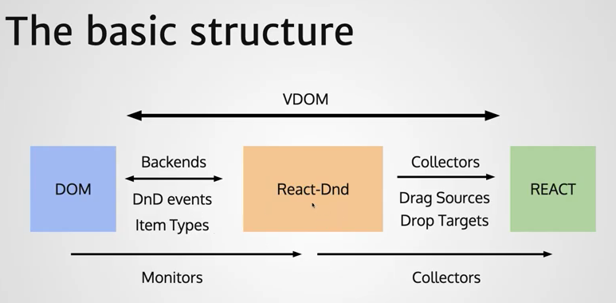

# React-DnD 簡單示範

## 基本概念



###### [Image Reference](https://www.youtube.com/watch?v=NW8erkUgqus&t=1593s)

HTML5 提供原生的[HTML5 Drag & Drop API](https://developer.mozilla.org/en-US/docs/Web/API/HTML_Drag_and_Drop_API)（以下簡稱 HTML5 DnD）實現 DOM 元素拖曳的功能。但是由於在 React 的生態底下，並不適合操作實體 DOM，因此 React-DnD 居於中間角色，作為雙方溝通的橋樑。對於 DOM 方監控 HTML5 DnD，對 React 方做 component 及 state 的處理。

### 1. Monitors

---

監控 HTML5 DnD 事件，其中包含三個要素，Backends、拖曳項目（Item）、監視器（Monitors）

#### Backends:

- HTML5: 支援 HTML5 DnD 事件
- Touch: 支援行動裝置的觸控螢幕拖曳
- Test: 支援 DnD 的互動測試

#### 拖曳項目（Item）:

- 拖曳元件的**身分識別**
- 定義拖曳元素可以**放置在哪裡**
- 其中攜帶拖曳元件的相關資訊，提供給放置元素進行放置動作的資料操作

#### 監視器（Monitors）:

- 提供 React 元件（component）來自於（實體）DOM 端的 DnD 事件
- 監視器會將收集到來自於 DOM 的事件注入至`context`中

### 2. Collectors

---

Collectors 收集 React 所需要資訊，包括收集函式（Collector Functions）、拖曳元件（Drag Sources）、放置（目標）元件（Drop Target）

#### 收集函式（Collector Functions）:

- 收集函式將監視器（monitor）得到的資訊注入 React 元件的`props`當中

#### 拖曳元件（Drag Sources）:

- 綁定可拖曳的元件（component）
- 攜帶拖曳元件的相關資訊，提供給放置元件

#### 放置（目標）元件（Drop Target）:

- 定義可接受放置的拖曳元件

## React-DnD API

### DndProvider:

定義拖曳（來源）元件（Drag Sources）及放置（目標）元件（Drop Target）的範圍

```javascript
import Backend from 'react-dnd-html5-backend'
import { DndProvider } from 'react-dnd'

export default class YourApp {
  render() {
    return (
      <DndProvider backend={Backend}>
        /* Your Drag-and-Drop Application */
      </DndProvider>
    )
  }
}
```

### 拖曳（來源）元件（Drag Sources）:
綁定拖曳的元件、定義拖曳的行為

```javascript
import { useDrag } from 'react-dnd'

function DraggableComponent(props) {
  const [collectedDragProps, drag, preview] = useDrag({
      // 必填欄位
      item: { type: 'task', id: 1 },
      // 選填欄位
      begin: monitor => {}, // 開始拖曳的時候要做什麼事
      end: (item, monitor) => {},
      isDragging: monitor => {}, // return isDragging 的條件
      canDrag: monitor => {}, // return canDrag 的條件
      collect: monitor => ({
        canDrag: Boolean(monitor.canDrag()), // 將上述的屬性值收集起來
        isDragging: Boolean(monitor.isDragging()),
        didDrop: Boolean(monitor.didDrop()),
      }),
    })

    const { canDrag, isDragging, didDrop } = collectedDragProps // 所有收集起來的值會 collectedDragProps 裡面

    return <div ref={drag}>...</div>
}
```

### 放置（目標）元件（Drop Target）:
綁定放置的元件、定義放置的行為

```javascript
import { useDrop } from 'react-dnd'
function myDropTarget(props) {
    const [collectedDropProps, drop] = useDrop({
    // 必填欄位
    accept: 'task', // 接受元件的類別，可以是一個陣列，放置多個接受的類別， 例如：['task', 'story']
    // 選填欄位
    drop: (item, monitor) => {}, // 拖曳元件放開的時候要做的事
    hover: (item, monitor) => {}, // 拖曳元件hover的時候要做的事
    canDrop: monitor => {}, // 定義是否可以拖曳的條件，return一個布林值
    collect: monitor => ({
      isOver: Boolean(monitor.isOver()), // 將上述的屬性值收集起來
      canDrop: Boolean(monitor.canDrop()),
    }),
  })

  const { isOver, canDrop } = collectedDropProps // 所有收集起來的值會 collectedDropProps 裡面

  return <div ref={drop}>Drop Target</div>
}
```

## 參考資料

- [React DnD](https://react-dnd.github.io/react-dnd/about)
- [Playing around with react-dnd - YouTube](https://www.youtube.com/watch?v=NW8erkUgqus&t=1593s)(推薦教學影片)
